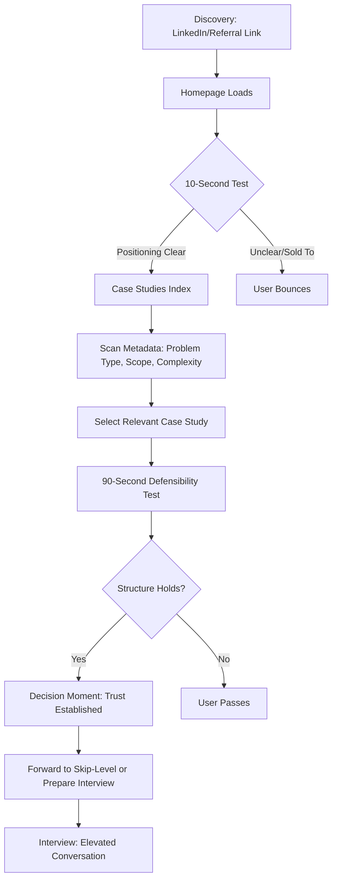
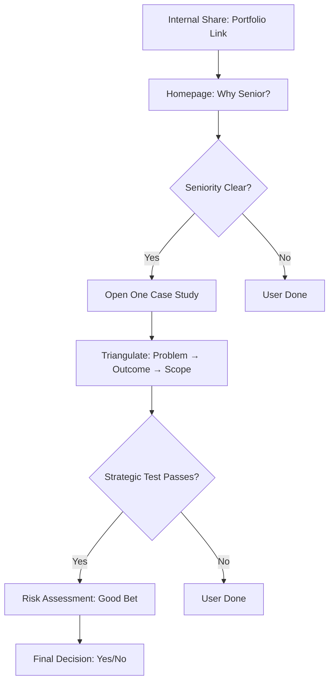
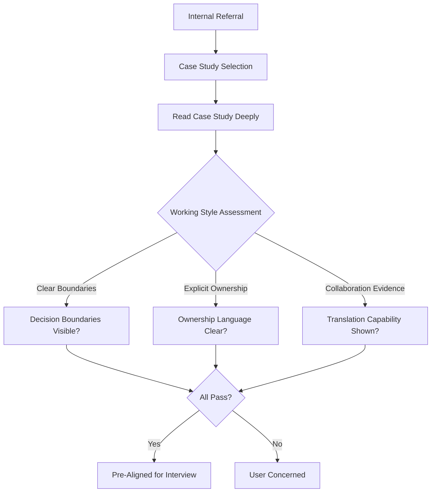

# UX Design Specification athan-dial.github.io

**Author:** Athan
**Date:** 2026-01-09

---

<!-- UX design content will be appended sequentially through collaborative workflow steps -->

---

## Executive Summary

### Project Vision

The athan-dial.github.io portfolio solves a critical trust gap: senior readers need to see product judgment and execution leadership, not just technical activity. This Hugo static site functions as an executive brief that makes three signals instantly clear: (1) ability to turn ambiguous, high-stakes problems into concrete decision loops with metrics, guardrails, and tradeoffs; (2) cross-functional leadership that ships outcomes, not just analysis; (3) communication that enables action, not just admiration.

**Critical Design Constraint:**
"Executive brief" is not a metaphor—it's a design constraint. The site is meant to be consumed non-linearly. Readers are triangulating trust, not learning a story. If anyone on the team thinks "narrative arc" before "decision surface," we'll lose the edge.

**Core Mantra:**
"This site reduces the reader's decision burden." If a feature doesn't do that, it's out of MVP.

### Target Users

**Primary Users:**
Hiring managers who own P&L-adjacent outcomes, not just team output. Directors, Senior Directors, Heads of Product/Data/Platform who are accountable for delivery and have been burned before by candidates with strong resumes but weak judgment.

**Secondary Users:**
Risk filters, not champions. Executives and skip-level reviewers (VPs, SVPs, GMs) who are risk assessors with brutally limited time and microscopic patience. They're asking "Is this a good bet?" not "Can this person do the work?"

**Tertiary Users:**
Future collaborators evaluating cognitive friction. Cross-functional partners (Engineering leads, senior scientists, ops/commercial partners) deciding "Do I want to work with this person?" They're judging working style, not just seniority.

### Key Design Challenges

**1. 10-Second Positioning Test**
Homepage must communicate seniority, decision ownership, and end-to-end product thinking within 10 seconds. If someone can't understand what kind of operator you are in 10 seconds, the MVP fails.

**Executive Brief Guardrail:**
If a page requires scrolling to understand seniority or scope, it has already failed the executive reader. Executives should understand why they're here before they understand what you did.

**2. 90-Second Defensibility Test**
Case studies must support rapid stress-testing of thinking, not prose reading. Every section should survive hostile reading. Structure must enable judgment assessment without deep reading. This is a defensibility test, not a scannable structure—that changes how designers think about hierarchy, emphasis, and what earns visual weight.

**3. Executive Brief Format (Design Constraint)**
This is not a typical portfolio—it's optimized for senior readers who triangulate (problem → outcome → scope) rather than read linearly. The site is meant to be consumed non-linearly. Readers are triangulating trust, not learning a story.

**4. "Calm Authority" Aesthetic**
Visual design must achieve calm authority with minimal customization of Blowfish theme. Typography hierarchy that privileges reading speed, generous whitespace, muted neutral color palette, strong section headers and subheaders.

**5. Decision-Forward Structure**
Information architecture must lead with problem framing, tradeoffs, and outcomes—not technical implementation details. Structure matters more than copy length.

**6. Core Frustration Reframe**
The core frustration is not "too much reading." It's too much interpretation required. Hiring managers don't want to decode. They want to recognize. That's why structure matters more than copy length.

### Design Opportunities

**1. Typography Hierarchy for Reading Speed**
Strong section headers and subheaders that enable rapid scanning and signal importance. Every section should survive hostile reading.

**2. Generous Whitespace**
Creates calm authority aesthetic while improving readability and reducing cognitive load. Confidence through omission—what's not said is as important as what is. Empty calories erode authority.

**3. Consistent Case Study Template**
Visual consistency across case studies enables comparison and structure recognition regardless of domain. The case study index is not a browsing experience—it's a selection interface for relevance under time pressure. Metadata clarity > visual delight. Titles and subtitles matter more than thumbnails.

**4. Gallery/Grid Browsing (Selection Interface)**
Fast scanning with strong metadata display (problem type, scope, complexity) enables problem-relevance-based selection. This is a selection interface, not a browsing experience.

**5. Proof Tiles on Homepage**
Proof tiles are decision evidence, not achievements. If a tile doesn't imply a hard call or meaningful tradeoff, it doesn't belong. Concrete outcomes and scope signals (not testimonials or buzzwords) that respect senior readers' time.

**6. Resume Page as Executive Summary**
The resume page must reinforce the case studies, not compete with them. It should read like an executive summary, not a career log. If someone spends more time on the resume than the case study, something went wrong.

**7. Restraint and Clarity**
No novelty for novelty's sake. Anything that draws attention to design over thinking is suspect. This product wins by restraint, clarity, and defensibility. If the team builds less than they think they should, they're probably doing it right.

### Key Features/Goals

**Homepage:**
- 10-second positioning communication with proof signals (decision evidence, not achievements)
- Immediate proof signals without scrolling
- Clear path to case studies
- If scrolling required to understand seniority/scope, it's failed

**Case Studies Index:**
- Selection interface for relevance under time pressure (not browsing experience)
- Gallery/grid format with strong metadata display (problem type, scope, complexity)
- Metadata clarity > visual delight
- Titles and subtitles matter more than thumbnails

**Case Studies (1-2 MVP):**
- 90-second defensibility test structure
- Answers 5 core questions: Context, Ownership, Decision Frame, Outcome, Reflection
- Every section should survive hostile reading
- Structure enables judgment assessment without deep reading

**Resume Page:**
- HTML snapshot + PDF link
- Scannable executive summary format (not career log)
- Must reinforce case studies, not compete with them
- If someone spends more time on resume than case study, something went wrong

### Brand Direction

**Visual:**
- "Calm authority" aesthetic: clean, editorial, low ornament, no stock-photo vibe
- Typography hierarchy that privileges reading speed
- Generous whitespace and muted, neutral color palette
- Strong section headers and subheaders
- No novelty for novelty's sake—anything that draws attention to design over thinking is suspect

**Voice:**
- Crisp, calm, decisive, concrete
- Confidence through omission—what's not said is as important as what is
- Empty calories erode authority

**Design Principles:**
- Restraint, clarity, defensibility
- If the team builds less than they think they should, they're probably doing it right
- This site reduces the reader's decision burden

---

## Core User Experience

### Defining Experience

**The ONE Critical User Action:**
Hiring managers assess product judgment and decision ownership within 90 seconds by scanning a case study. This is the core interaction that defines the product's value. If this fails, the product fails.

**Core Experience Loop:**
1. **Discovery:** User arrives at homepage (via LinkedIn, referral, or resume link)
2. **10-Second Test:** Homepage communicates positioning and signals seniority
3. **Selection:** User navigates to case studies index and selects relevant case study based on problem relevance
4. **90-Second Defensibility Test:** User scans case study structure, stress-testing thinking (problem clarity, decision logic, tradeoffs, outcome honesty)
5. **Decision Moment:** User shifts from evaluation → curiosity, skepticism → engagement
6. **Outcome:** Portfolio compresses trust-building, changing interview conversation quality

**What Makes This Effortless:**
- No decoding required—users recognize judgment quality through structure, not interpretation
- Non-linear consumption—readers triangulate trust (problem → outcome → scope) rather than read linearly
- Structure over content—consistent case study structure enables comparison and recognition regardless of domain
- Metadata clarity enables problem-relevance-based selection without deep reading

### Platform Strategy

**Primary Platform:**
Web (desktop/laptop browser) - Hugo static site hosted on GitHub Pages

**Device Context:**
- **Primary:** Laptop/desktop (between meetings, half-attentive, time-boxed)
- **Secondary:** Tablet (occasional mobile viewing, but not primary use case)
- **Mobile:** Responsive design required, but not optimized for mobile-first

**Interaction Model:**
- Mouse/keyboard primary (not touch-optimized)
- Fast loading critical (2 seconds on 3G connection)
- No offline functionality required
- No device-specific capabilities needed

**Technical Constraints:**
- Static site generation (Hugo)
- Minimal client-side JavaScript
- Serverless hosting (GitHub Pages)
- No backend services or databases

### Effortless Interactions

**What Should Feel Completely Natural:**

1. **10-Second Homepage Recognition:**
   - User immediately understands positioning without scrolling
   - Proof signals visible without interaction
   - Clear path to case studies requires zero thought

2. **Case Study Selection:**
   - Metadata (problem type, scope, complexity) enables instant relevance assessment
   - Titles and subtitles communicate more than visuals
   - Selection interface (not browsing) reduces cognitive load

3. **90-Second Defensibility Test:**
   - Case study structure enables rapid stress-testing
   - Every section survives hostile reading
   - Hierarchy and emphasis guide eye to decision evidence
   - No scrolling required to understand seniority or scope

**Where Users Currently Struggle:**
- Too much interpretation required (decoding vs. recognizing)
- Technical portfolios bury decisions in implementation details
- Typical portfolios require deep reading to extract signal
- Lack of structure makes comparison impossible

**What Should Happen Automatically:**
- Visual hierarchy guides eye to decision evidence
- Consistent structure enables recognition across case studies
- Typography and whitespace create calm authority without user effort
- Metadata enables problem-relevance matching without conscious filtering

**Where We Eliminate Steps:**
- No "about me" section required to understand positioning
- No testimonials or external validation needed
- No narrative arc to follow—triangulation replaces linear reading
- No scrolling to understand seniority (executive brief guardrail)

### Critical Success Moments

**The Make-or-Break Moment:**
When a hiring manager thinks: **"I don't need to test basics with this person."** This is the shift from evaluation → curiosity, skepticism → engagement. If this moment doesn't happen, the portfolio has failed.

**Critical Success Flows:**

1. **Homepage → Recognition (10 seconds):**
   - User understands positioning without scrolling
   - Proof signals communicate decision evidence (not achievements)
   - User feels understood, not sold to
   - **If this fails:** User bounces immediately

2. **Case Study Index → Selection (30 seconds):**
   - User identifies relevant case study based on problem relevance
   - Metadata clarity enables selection without deep reading
   - **If this fails:** User can't find relevant case study, abandons

3. **Case Study → Defensibility Test (90 seconds):**
   - User stress-tests thinking through structure
   - Every section survives hostile reading
   - User recognizes judgment quality, not just technical skill
   - **If this fails:** User doesn't trust judgment, passes

4. **Post-Portfolio Impact:**
   - Interview conversation elevates from "tell me what you did" to "how would you approach our problem"
   - Portfolio compresses trust-building
   - **If this fails:** Portfolio didn't change evaluation, wasted effort

**First-Time User Success:**
A hiring manager can complete the full loop (homepage → case study selection → defensibility test → decision moment) within 2 minutes and arrive at the decision moment. This is first-time user success.

### Experience Principles

**1. Reduce Decision Burden**
Every design decision must answer: "Does this reduce the reader's decision burden?" If not, it's out of MVP. This is the core mantra that guides all UX decisions.

**2. Recognition Over Decoding**
Users should recognize judgment quality through structure, not interpret meaning from prose. Structure matters more than copy length. If users must decode, the design has failed.

**3. Defensibility Over Delight**
Every section should survive hostile reading. Visual hierarchy, emphasis, and weight should guide eye to decision evidence. The 90-second defensibility test is more important than visual delight.

**4. Restraint Over Polish**
If the team builds less than they think they should, they're probably doing it right. No novelty for novelty's sake. Anything that draws attention to design over thinking is suspect. Confidence through omission.

**5. Non-Linear Consumption**
The site is consumed non-linearly. Readers triangulate trust (problem → outcome → scope), not learn a story. If anyone thinks "narrative arc" before "decision surface," we've lost the edge.

**6. Metadata Clarity Over Visual Delight**
In the case studies index, metadata clarity > visual delight. Titles and subtitles matter more than thumbnails. This is a selection interface, not a browsing experience.

**7. Executive Brief Guardrail**
If a page requires scrolling to understand seniority or scope, it has already failed the executive reader. Executives should understand why they're here before they understand what you did.

**8. Decision Evidence Over Achievements**
Proof tiles are decision evidence, not achievements. If a tile doesn't imply a hard call or meaningful tradeoff, it doesn't belong. Every visual element must support judgment recognition.

---

## Desired Emotional Response

### Primary Emotional Goals

**Core Emotional Goal: Relief and Recognition**
The primary emotional response should be: **"Good, this person thinks the way I think."** This is not fireworks or delight—it's relief. The emotional goal is cognitive alignment, not visual excitement.

**Secondary Emotional States:**
- **Trust:** Users feel they can trust the judgment demonstrated
- **Confidence:** Users feel confident in their assessment without needing more information
- **Respect:** Users feel their time is respected (no fluff, no selling)
- **Clarity:** Users feel clear about what they're evaluating, not confused

**Emotions to Avoid:**
- **Skepticism:** Users should not feel sold to or marketed at
- **Confusion:** Users should not need to decode or interpret meaning
- **Overwhelm:** Users should not feel there's too much to process
- **Doubt:** Users should not question whether they're seeing real judgment or storytelling

### Emotional Journey Mapping

**Discovery (Homepage - First 10 Seconds):**
- **Feeling:** Understood, not sold to
- **Emotion:** "This person respects my time"
- **State:** Skeptical but open → Engaged
- **If fails:** Feels marketed at → Bounces immediately

**Selection (Case Studies Index - 30 seconds):**
- **Feeling:** Clear and efficient
- **Emotion:** "I can find what's relevant quickly"
- **State:** Scanning → Selecting
- **If fails:** Can't find relevance → Abandons

**Assessment (Case Study - 90 seconds):**
- **Feeling:** Confident in judgment
- **Emotion:** "I don't need to test basics with this person"
- **State:** Evaluation → Curiosity, Skepticism → Engagement
- **If fails:** Doesn't trust judgment → Passes

**Decision Moment:**
- **Feeling:** Decision burden reduced
- **Emotion:** "This person would reduce my decision load"
- **State:** From evaluation to engagement
- **Success:** Portfolio compresses trust-building

**Post-Portfolio:**
- **Feeling:** Prepared and aligned
- **Emotion:** "I know what to ask in the interview"
- **State:** Ready for deeper conversation
- **Outcome:** Interview elevates from basics to strategy

### Micro-Emotions

**Critical Micro-Emotions:**

1. **Confidence (not Confusion):**
   - Users should feel confident they understand what they're evaluating
   - Structure enables recognition, not interpretation
   - **Design implication:** Clear hierarchy, consistent structure, explicit signals

2. **Trust (not Skepticism):**
   - Users should trust the judgment demonstrated, not question authenticity
   - Defensible evidence builds trust, not marketing
   - **Design implication:** Proof tiles show decision evidence, not achievements

3. **Respect (not Disrespect):**
   - Users should feel their time is respected
   - No fluff, no unnecessary steps, no selling
   - **Design implication:** 10-second test, no scrolling required for seniority, metadata clarity

4. **Relief (not Anxiety):**
   - Users should feel relief: "This person thinks the way I think"
   - Not anxiety about whether they're making the right assessment
   - **Design implication:** Consistent structure enables comparison, defensibility test passes

5. **Clarity (not Ambiguity):**
   - Users should feel clear about positioning and judgment quality
   - No ambiguity about ownership, decisions, or outcomes
   - **Design implication:** Clear ownership language, explicit tradeoffs, outcome honesty

### Design Implications

**If we want users to feel Relief and Recognition:**
- Structure must enable recognition, not require interpretation
- Consistent case study template allows comparison regardless of domain
- Visual hierarchy guides eye to decision evidence
- Typography and whitespace create calm, not chaos

**If we want users to feel Trust (not Skepticism):**
- Proof tiles show decision evidence (hard calls, tradeoffs), not achievements
- No marketing language or testimonials
- Defensible evidence (metrics, constraints, outcomes) visible upfront
- Calm, non-performative confidence in presentation

**If we want users to feel Respect (not Disrespect):**
- 10-second positioning test (no scrolling required)
- Metadata clarity enables fast selection
- No unnecessary steps or interactions
- Executive brief guardrail: understand why before what

**If we want users to feel Confidence (not Confusion):**
- Clear information architecture
- Consistent structure across all case studies
- Explicit signals (problem type, scope, complexity) in index
- Every section survives hostile reading

**Interactions that Create Negative Emotions to Avoid:**
- Scrolling required to understand seniority → Disrespect
- Ambiguous ownership language → Confusion
- Marketing language or testimonials → Skepticism
- Inconsistent structure → Lack of confidence
- Too much visual polish → Distraction from thinking

### Emotional Design Principles

**1. Relief Through Recognition**
Design for recognition, not interpretation. Users should recognize judgment quality through structure, not decode meaning from prose. Structure matters more than copy length.

**2. Trust Through Evidence**
Build trust through defensible evidence, not marketing. Every visual element must support judgment recognition. Proof tiles are decision evidence, not achievements.

**3. Respect Through Efficiency**
Respect user time through efficiency. 10-second test, no scrolling for seniority, metadata clarity. If a page requires scrolling to understand seniority or scope, it has failed.

**4. Confidence Through Consistency**
Build confidence through consistent structure. Case studies enable comparison regardless of domain. Visual consistency creates calm authority.

**5. Clarity Through Restraint**
Achieve clarity through restraint. No novelty for novelty's sake. Anything that draws attention to design over thinking is suspect. Confidence through omission.

---

## UX Pattern Analysis & Inspiration

### Inspiring Products Analysis

**Executive Brief Format Inspiration:**
The portfolio draws inspiration from executive briefs and decision-support documents used in senior business contexts. These documents are optimized for:
- Non-linear consumption (triangulation vs. linear reading)
- Rapid signal extraction (scannable headers, proof tiles)
- Decision evidence over narrative storytelling
- Calm authority aesthetic (editorial, low ornament)

**Key Patterns from Executive Briefs:**
- **Scannable Headers:** Strong typography hierarchy that enables rapid assessment
- **Proof Tiles:** Decision evidence displayed upfront, not buried in prose
- **Structured Sections:** Consistent framework enables comparison and recognition
- **Minimal Ornament:** Clean, editorial design that privileges content over decoration

**Portfolio Site Anti-Patterns to Avoid:**
- **Narrative Arc Thinking:** Avoid storytelling structure that requires linear reading
- **Visual Delight Over Clarity:** Avoid animations or interactions that distract from decision evidence
- **Achievement Showcase:** Avoid proof tiles that show achievements without decision context
- **Technical Depth First:** Avoid leading with implementation details before decision logic

### Transferable UX Patterns

**Navigation Patterns:**
- **Gallery/Grid Selection Interface:** Fast scanning with metadata display (problem type, scope, complexity) enables problem-relevance-based selection
- **Consistent Structure Preview:** Case studies index shows structure preview, not just thumbnails
- **Clear Information Architecture:** Homepage → Case Studies Index → Case Study → Resume (simple, clear path)

**Interaction Patterns:**
- **90-Second Defensibility Test:** Structure enables rapid stress-testing without deep reading
- **10-Second Positioning Test:** Homepage communicates positioning without scrolling
- **Non-Linear Consumption:** Readers triangulate trust (problem → outcome → scope) rather than read linearly

**Visual Patterns:**
- **Typography Hierarchy for Reading Speed:** Strong section headers and subheaders enable rapid scanning
- **Generous Whitespace:** Creates calm authority while improving readability
- **Muted Neutral Palette:** Supports calm authority aesthetic without distraction

### Anti-Patterns to Avoid

**Portfolio Anti-Patterns:**
- **Narrative Arc Structure:** Requires linear reading, doesn't support triangulation
- **Technical Depth First:** Buries decisions in implementation details
- **Achievement Showcase:** Shows outcomes without decision context
- **Visual Delight Over Clarity:** Distracts from judgment recognition
- **Marketing Language:** Creates skepticism instead of trust
- **Inconsistent Structure:** Prevents comparison and recognition

**Interaction Anti-Patterns:**
- **Scrolling Required for Seniority:** Violates executive brief guardrail
- **Ambiguous Ownership Language:** Creates confusion instead of clarity
- **Too Much Visual Polish:** Distracts from thinking over design
- **Complex Filtering/Tagging:** Adds unnecessary cognitive load for MVP

### Design Inspiration Strategy

**What to Adopt:**
- **Executive Brief Format:** Non-linear consumption, triangulation, scannable structure
- **Typography Hierarchy:** Strong headers and subheaders for reading speed
- **Generous Whitespace:** Calm authority aesthetic
- **Consistent Structure:** Enables comparison and recognition

**What to Adapt:**
- **Blowfish Theme:** Minimal customization to achieve calm authority (typography, whitespace, color palette)
- **Gallery/Grid Pattern:** Adapt for selection interface (not browsing) with strong metadata
- **Case Study Template:** Adapt standard portfolio case study to 5-question defensibility framework

**What to Avoid:**
- **Narrative Arc Thinking:** Decision surface, not story
- **Visual Delight Patterns:** Restraint over polish
- **Achievement Showcase Patterns:** Decision evidence, not achievements
- **Technical Portfolio Patterns:** Decision-forward, not technical-first

---

## Design System Foundation

### Design System Choice

**Chosen System: Blowfish Theme for Hugo**
Blowfish is a Hugo theme that provides 80% of what's needed for a clean, modern portfolio site. The strategy is to take what Blowfish offers and make minimal customizations to achieve "calm authority" aesthetic.

**Rationale for Selection:**
- **Speed:** Blowfish provides proven components and layouts out of the box
- **Minimal Customization:** Achieves 80% of requirements with minimal effort
- **Hugo Integration:** Native Hugo theme, perfect for static site generation
- **Clean Foundation:** Base design is clean and editorial, aligns with calm authority direction
- **Maintainability:** Standard theme reduces long-term maintenance burden

### Implementation Approach

**Blowfish Theme Base:**
- Use Blowfish as the foundation theme
- Leverage existing components: navigation, layouts, typography system
- Customize only what's necessary for "calm authority" aesthetic

**Required Customizations:**
- Typography hierarchy adjustments (privilege reading speed)
- Generous whitespace (increase spacing)
- Muted, neutral color palette (adjust theme colors)
- Strong section headers and subheaders (typography weights)
- Consistent case study template (custom layout)

**Explicitly Not Required for MVP:**
- Custom components (use Blowfish defaults)
- Micro-interactions (no animations needed)
- Dark mode tuning (not MVP)
- Advanced theming (minimal customization only)
- Custom CMS logic (markdown-based content)

**Blowfish Philosophy:**
"Blowfish already gets you 80%. Take it. Don't fight it." This aligns with the restraint principle: if the team builds less than they think they should, they're probably doing it right.

### Customization Strategy

**Typography Customization:**
- Adjust type scale to privilege reading speed
- Increase font weights for headers and subheaders
- Ensure line heights support rapid scanning
- Maintain Blowfish's base font choices unless brand requires otherwise

**Spacing Customization:**
- Increase whitespace between sections
- Generous margins and padding
- Maintain Blowfish's spacing system but increase values

**Color Customization:**
- Muted, neutral color palette
- Reduce saturation from Blowfish defaults if needed
- Ensure WCAG AA contrast compliance
- Use Blowfish's color system as foundation

**Layout Customization:**
- Case study template: custom layout for 5-question framework
- Gallery/grid index: adapt Blowfish's content listing patterns
- Homepage: use Blowfish's hero and content sections
- Resume page: use Blowfish's page template

---

## 2. Core User Experience

### 2.1 Defining Experience

**The Defining Experience:**
Hiring managers assess product judgment and decision ownership within 90 seconds by scanning a case study. This is the core interaction that defines the product's value. If this fails, the product fails.

**Core Action Description:**
Users will describe this as: "I can assess whether this person has product judgment in under 90 seconds by scanning their case study structure." This is the interaction that makes users feel successful.

**What Makes This Special:**
- Non-linear consumption (triangulation vs. linear reading)
- Structure enables recognition, not interpretation
- Defensibility test survives hostile reading
- Decision evidence visible upfront

### 2.2 User Mental Model

**Current Mental Model:**
Users (hiring managers) bring expectations from:
- **Resumes:** Credentials, scope, trajectory (but lack decision evidence)
- **Technical Portfolios:** Code, models, algorithms (but bury decision logic)
- **Case Study Sites:** Client outcomes (but lack personal ownership)

**Expected Mental Model:**
Users expect to:
- Scan quickly and extract signal
- Compare candidates based on judgment quality
- Recognize decision-making structure
- Assess ownership and tradeoffs

**Where Users Get Confused:**
- Too much interpretation required (decoding vs. recognizing)
- Inconsistent structure prevents comparison
- Ambiguous ownership language creates doubt
- Marketing language creates skepticism

**How We Align with Mental Model:**
- Consistent structure enables recognition
- Clear ownership language reduces interpretation
- Decision evidence (not achievements) builds trust
- Executive brief format matches senior reader expectations

### 2.3 Success Criteria

**Core Experience Success Criteria:**

**What Makes Users Say "This Just Works":**
- User can assess positioning within 10 seconds (no scrolling)
- User can select relevant case study within 30 seconds
- User can complete defensibility test within 90 seconds
- User recognizes judgment quality through structure, not interpretation

**When Users Feel Successful:**
- User thinks: "I don't need to test basics with this person"
- User shifts from evaluation → curiosity, skepticism → engagement
- User feels decision burden is reduced
- User arrives at interviews pre-aligned

**Feedback That Tells Users They're Doing It Right:**
- Structure is consistent and recognizable
- Decision evidence is visible upfront
- Metadata enables fast selection
- Every section survives hostile reading

**How Fast Should It Feel:**
- Homepage: 10 seconds to understand positioning
- Case study selection: 30 seconds to find relevance
- Case study assessment: 90 seconds to complete defensibility test
- Total: 2 minutes to decision moment

**What Should Happen Automatically:**
- Visual hierarchy guides eye to decision evidence
- Consistent structure enables recognition
- Typography and whitespace create calm authority
- Metadata enables problem-relevance matching

### 2.4 Novel UX Patterns

**Pattern Analysis:**
The portfolio uses **established patterns** (executive brief format, gallery/grid browsing, case study structure) but combines them in a **novel way** for portfolio sites.

**Novel Combination:**
- Executive brief format (established in business context) + Portfolio site (established pattern) = Novel application
- Decision-forward structure (established in product management) + Case study format (established pattern) = Novel combination
- 90-second defensibility test (established in evaluation contexts) + Portfolio showcase (established pattern) = Novel approach

**What Makes This Different:**
- Non-linear consumption (triangulation) vs. linear narrative
- Decision evidence (not achievements) as proof signals
- Defensibility test structure vs. storytelling structure
- Selection interface (not browsing) for case studies

**How We Teach Users:**
- Consistent structure teaches recognition (not interpretation)
- Visual hierarchy guides eye to decision evidence
- Metadata clarity enables problem-relevance matching
- Executive brief guardrail (no scrolling for seniority) sets expectations

**Familiar Metaphors:**
- Executive brief (business context)
- Case study (portfolio context)
- Gallery/grid (browsing context)
- Resume (hiring context)

### 2.5 Experience Mechanics

**Core Experience Mechanics: 90-Second Defensibility Test**

**1. Initiation:**
- **How user starts:** Arrives at case study page (from index selection or direct link)
- **What triggers:** User has selected case study based on problem relevance
- **User state:** Skeptical but open, time-boxed to 90 seconds

**2. Interaction:**
- **What user does:** Scans case study structure, stress-testing thinking
- **Controls/inputs:** Eye movement, scrolling (minimal), reading (selective)
- **System response:** Structure enables rapid assessment, hierarchy guides eye to decision evidence
- **User mental model:** Running judgment test checklist (problem clarity, decision logic, tradeoffs, outcome honesty)

**3. Feedback:**
- **Success indicators:** Every section survives hostile reading, structure holds up under stress-testing
- **Progress signals:** User slows down when structure holds, recognizes judgment quality
- **Error recovery:** If structure doesn't hold, user bounces; if it holds, user engages deeper

**4. Completion:**
- **How user knows they're done:** Decision moment reached: "I don't need to test basics with this person"
- **Successful outcome:** User shifts from evaluation → curiosity, skepticism → engagement
- **What's next:** User forwards to skip-level, prepares for interview, or moves to next case study

---

## Visual Design Foundation

### Color System

**Color Strategy:**
Muted, neutral color palette that supports "calm authority" aesthetic. Colors should not distract from thinking or decision evidence.

**Primary Colors:**
- **Base:** Neutral grays (from Blowfish theme, adjusted for muted tone)
- **Accent:** Minimal accent color (if needed, very subtle)
- **Text:** High contrast for readability (WCAG AA compliance)

**Semantic Color Mapping:**
- **Primary:** Neutral, authoritative (not bright or attention-grabbing)
- **Secondary:** Supporting, subtle
- **Success/Error/Warning:** Standard accessibility colors (minimal use, only when necessary)
- **Background:** Clean whites/light grays
- **Text:** Dark grays/blacks for readability

**Accessibility Compliance:**
- Color contrast meets WCAG 2.1 Level AA (4.5:1 for normal text, 3:1 for large text)
- Color not used as sole indicator of meaning
- High contrast mode support

**Brand Alignment:**
- Muted, neutral palette supports "calm authority"
- No bright or attention-grabbing colors
- Colors support content, don't compete with it

### Typography System

**Typography Strategy:**
Typography hierarchy that privileges reading speed. Strong section headers and subheaders enable rapid scanning and signal importance.

**Typeface Selection:**
- **Primary:** Blowfish default (system font stack or theme default)
- **Rationale:** Blowfish's typography is clean and readable; only adjust if brand requires specific font
- **Customization:** Adjust weights and sizes, not necessarily the font family

**Type Scale:**
- **H1:** Large, bold, strong visual weight (homepage positioning, case study titles)
- **H2:** Strong section headers (case study sections: Context, Ownership, Decision Frame, etc.)
- **H3:** Subsection headers (supporting H2 sections)
- **Body:** Readable, appropriate line height for scanning
- **Small:** Metadata, captions, supporting text

**Typography Hierarchy:**
- Headers and subheaders are visually strong and consistent
- Line heights support rapid scanning (not too tight, not too loose)
- Font weights create clear hierarchy (bold headers, regular body)
- Typography privileges reading speed over visual decoration

**Content Considerations:**
- Long-form reading (case studies)
- Scannable structure (headers enable rapid assessment)
- Metadata display (titles, subtitles in index)
- Executive summary format (resume page)

### Spacing & Layout Foundation

**Spacing Strategy:**
Generous whitespace creates calm authority aesthetic while improving readability and reducing cognitive load.

**Spacing Unit:**
- Base unit: 8px or 16px (standard spacing system)
- Generous margins and padding between sections
- Increased whitespace compared to typical portfolio sites

**Layout Principles:**
- **Airy and Spacious:** Not dense and efficient (this is not a dashboard)
- **Editorial Density:** Appropriate for reading, not data display
- **Whitespace as Design Element:** Confidence through omission
- **Clear Section Separation:** Generous spacing between case study sections

**Grid System:**
- Use Blowfish's layout system as foundation
- Case studies index: Gallery/grid with appropriate column structure
- Case study pages: Single column, wide reading width
- Homepage: Hero section + content sections (Blowfish pattern)

**Component Spacing:**
- Generous padding around proof tiles
- Clear separation between case study sections
- Appropriate spacing in gallery/grid index
- Comfortable reading width for case studies

### Accessibility Considerations

**WCAG Compliance:**
- **Target Level:** WCAG 2.1 Level AA (baseline requirement)
- **Color Contrast:** 4.5:1 for normal text, 3:1 for large text
- **Keyboard Navigation:** Full keyboard support throughout site
- **Screen Reader Support:** Semantic HTML, ARIA labels where needed
- **Focus Indicators:** Clear focus states for keyboard navigation

**Typography Accessibility:**
- Font sizes meet minimum readability standards
- Line heights support readability
- Color contrast meets WCAG AA standards
- Text is resizable without breaking layout

**Interaction Accessibility:**
- All interactive elements keyboard accessible
- Touch targets meet minimum size (44x44px if applicable)
- Focus management for keyboard navigation
- Skip links for main content

---

## Design Direction Decision

### Design Directions Explored

**Direction 1: Minimal Executive Brief**
- Maximum whitespace, minimal visual elements
- Typography-driven design
- Proof tiles as simple text blocks
- **Rationale:** Purest expression of "calm authority"

**Direction 2: Editorial Portfolio**
- Magazine-style layout with strong typography
- Generous whitespace with subtle visual elements
- Proof tiles with minimal visual treatment
- **Rationale:** Balances authority with visual interest

**Direction 3: Structured Documentation**
- Documentation-site aesthetic (like technical docs)
- Very clean, very structured
- Minimal color, maximum clarity
- **Rationale:** Emphasizes structure and defensibility

**Chosen Direction: Editorial Portfolio (Direction 2)**
This direction balances calm authority with enough visual interest to maintain engagement. It's not minimal to the point of feeling sterile, but not decorative to the point of distraction.

### Design Rationale

**Why Editorial Portfolio:**
- **Calm Authority:** Achieves calm authority without feeling cold or sterile
- **Reading Speed:** Typography hierarchy supports rapid scanning
- **Visual Interest:** Subtle visual elements maintain engagement without distraction
- **Blowfish Alignment:** Works well with Blowfish theme's editorial aesthetic
- **Restraint:** Still maintains restraint—no novelty for novelty's sake

**Key Elements:**
- Strong typography hierarchy
- Generous whitespace
- Muted neutral color palette
- Subtle visual elements (not decorative)
- Consistent structure across all pages

### Implementation Approach

**Blowfish Theme Customization:**
- Start with Blowfish's editorial aesthetic
- Adjust typography weights and sizes for reading speed
- Increase whitespace (spacing values)
- Mute color palette (reduce saturation if needed)
- Custom case study template layout

**Visual Elements:**
- Proof tiles: Simple, text-forward (not card-based with heavy visuals)
- Case study sections: Clear typography hierarchy, generous spacing
- Gallery/grid: Clean, metadata-forward (not image-heavy)
- Navigation: Simple, clear (Blowfish default)

**Restraint Principles:**
- No custom components unless absolutely necessary
- No micro-interactions or animations
- No advanced theming beyond typography, spacing, colors
- Confidence through omission

---

## User Journey Flows

### Journey 1: Hiring Manager - Fast Filter to Deep Engagement

**Flow Design:**

**Entry Point:** LinkedIn application click, referral email, or resume link

**Information Needed at Each Step:**
- **Homepage:** Positioning statement, proof signals, path to case studies
- **Index:** Case study metadata (problem type, scope, complexity), titles, subtitles
- **Case Study:** 5-question structure (Context, Ownership, Decision Frame, Outcome, Reflection)

**Decision Points:**
- 10-second test: Is positioning clear? (If no → bounce)
- Case study selection: Is there relevant case study? (If no → abandon)
- Defensibility test: Does structure hold? (If no → pass)

**Success Indicators:**
- User understands positioning without scrolling
- User finds relevant case study quickly
- User completes defensibility test within 90 seconds
- User reaches decision moment: "I don't need to test basics"

**Error Recovery:**
- If homepage fails 10-second test: User bounces (no recovery needed—design failure)
- If no relevant case study: User abandons (need multiple case studies for range)
- If structure doesn't hold: User passes (need better case study content)

### Journey 2: Executive - Strategic Upside Assessment

**Flow Design:**

**Entry Point:** Internal Slack message, email share, or hiring committee review

**Information Needed:**
- **Homepage:** "Why is this person senior?" answer
- **Case Study:** Problem framing, outcomes, scope of influence (triangulation points)

**Decision Points:**
- Homepage: Is seniority clear? (If no → done)
- Strategic test: Problem selection, value creation, judgment under constraint? (If no → done)

**Success Indicators:**
- User understands seniority instantly
- User can triangulate trust (problem → outcome → scope)
- User completes risk assessment: "Is this a good bet?"

### Journey 3: Cross-Functional Partner - Collaboration Quality Prediction

**Flow Design:**

**Entry Point:** Colleague Slack message or interview loop referral

**Information Needed:**
- Case study showing decision boundaries, explicit ownership, collaboration evidence
- Technical depth with decision context
- Translation capability (technical ↔ business)

**Success Indicators:**
- User sees clear decision boundaries
- User sees explicit ownership (not "we did X" fog)
- User sees collaboration evidence
- User arrives at interview pre-aligned

### Journey Patterns

**Common Patterns Across Journeys:**

**Navigation Pattern:**
- Homepage → Case Studies Index → Case Study → (optional) Resume
- Consistent navigation structure across all pages
- Clear return path to homepage

**Selection Pattern:**
- Metadata enables problem-relevance-based selection
- Titles and subtitles communicate more than visuals
- Consistent structure preview enables comparison

**Assessment Pattern:**
- 90-second defensibility test structure
- Every section survives hostile reading
- Visual hierarchy guides eye to decision evidence

**Feedback Pattern:**
- Structure holds up under stress-testing (implicit feedback)
- Consistent structure enables recognition (positive feedback)
- If structure doesn't hold, user bounces (negative feedback)

### Flow Optimization Principles

**Minimize Steps to Value:**
- Homepage: 10 seconds to positioning
- Index: 30 seconds to selection
- Case Study: 90 seconds to decision moment
- Total: 2 minutes to value

**Reduce Cognitive Load:**
- Consistent structure reduces interpretation
- Metadata clarity enables fast selection
- Visual hierarchy guides eye automatically
- No unnecessary steps or interactions

**Clear Feedback:**
- Structure recognition (implicit feedback)
- Consistent structure (positive feedback)
- If structure fails, user bounces (clear negative feedback)

**Handle Edge Cases:**
- Wrong case study selection: Consistent structure enables quick comparison and re-selection
- No relevant case study: Multiple case studies show range
- Structure doesn't hold: Need better case study content (not design issue)

---

## Component Strategy

### Design System Components

**Available from Blowfish Theme:**
- Navigation components (header, footer, menu)
- Layout components (hero, content sections, cards)
- Typography system (headings, body text, metadata)
- Basic form elements (if needed)
- Page templates (homepage, content pages, list pages)

**Blowfish Components to Use:**
- **Navigation:** Blowfish's header/navigation (minimal customization)
- **Layouts:** Blowfish's page templates (homepage, content, list)
- **Typography:** Blowfish's type system (with weight/size adjustments)
- **Cards/Content Blocks:** Blowfish's content listing patterns (for case studies index)

### Custom Components

**1. Proof Tiles Component**

**Purpose:** Display decision evidence (not achievements) on homepage

**Content:** 
- Decision evidence text (hard calls, tradeoffs)
- Outcome/metric if relevant
- Scope indicator if relevant

**Actions:** 
- Click to navigate to related case study (optional)
- Or static display (no interaction needed)

**States:**
- Default: Visible, readable
- Hover: Subtle highlight (if clickable)
- No error/disabled states needed

**Variants:**
- Single proof tile
- Grid of proof tiles (2-3 columns on desktop)

**Accessibility:**
- Semantic HTML (article or section)
- If clickable: keyboard navigation, focus indicator
- Alt text not needed (text-based component)

**Content Guidelines:**
- Must imply hard call or meaningful tradeoff
- Decision evidence, not achievements
- Concrete outcomes and scope signals
- No testimonials or buzzwords

**2. Case Study Index Card Component**

**Purpose:** Display case study metadata in gallery/grid for fast selection

**Content:**
- Case study title
- Subtitle (problem statement summary)
- Metadata: Problem type, scope, complexity
- Optional: Brief excerpt (1-2 lines max)

**Actions:**
- Click to navigate to full case study

**States:**
- Default: Visible in grid
- Hover: Subtle highlight, maybe slight elevation
- Active: When selected/clicked

**Variants:**
- Grid item (consistent size)
- List item (alternative layout, not primary)

**Accessibility:**
- Semantic HTML (article with heading)
- Keyboard navigation support
- Focus indicator
- ARIA label: "Case study: [title]"

**Content Guidelines:**
- Title and subtitle matter more than visuals
- Metadata clarity > visual delight
- Problem type, scope, complexity clearly displayed

**3. Case Study Section Component**

**Purpose:** Display each of the 5 core questions (Context, Ownership, Decision Frame, Outcome, Reflection)

**Content:**
- Section header (Context, Ownership, etc.)
- Section content (structured text)
- Optional: Supporting elements (metrics, constraints, tradeoffs)

**Actions:**
- None (reading component)

**States:**
- Default: Visible, readable
- No interactive states needed

**Variants:**
- Context section
- Ownership section
- Decision Frame section
- Outcome section
- Reflection section
- (Each has consistent structure but different content requirements)

**Accessibility:**
- Semantic HTML (section with heading)
- Proper heading hierarchy (H2 for section, H3 for subsections)
- Keyboard navigation (for page structure)
- Screen reader friendly structure

**Content Guidelines:**
- Every section must survive hostile reading
- Clear ownership language
- Explicit tradeoffs and constraints
- Outcome honesty with metrics/constraints

**4. Resume Executive Summary Component**

**Purpose:** Display resume content in scannable executive summary format

**Content:**
- Resume content (HTML format)
- PDF download link
- Scannable structure (not career log)

**Actions:**
- Download PDF
- Navigate back to homepage or case studies

**States:**
- Default: Visible, readable
- PDF link: Standard link state

**Accessibility:**
- Semantic HTML structure
- PDF link with clear label: "Download resume as PDF"
- Keyboard navigation support

**Content Guidelines:**
- Executive summary format (not career log)
- Must reinforce case studies, not compete
- Scannable structure
- If user spends more time here than case study, something's wrong

### Component Implementation Strategy

**Foundation Components (from Blowfish):**
- Navigation (header, footer)
- Layout templates (homepage, content pages)
- Typography system
- Basic content blocks

**Custom Components (designed above):**
- Proof tiles (homepage)
- Case study index card (gallery/grid)
- Case study section (5-question framework)
- Resume executive summary

**Implementation Approach:**
- Build custom components using Blowfish design tokens (colors, spacing, typography)
- Ensure consistency with Blowfish patterns
- Follow accessibility best practices (WCAG AA)
- Create reusable Hugo shortcodes or partials for custom components

**Component Priority:**
- **Phase 1 (MVP):** Case study section component (core value), Proof tiles (homepage), Case study index card (selection)
- **Phase 2:** Resume executive summary component
- **Phase 3:** Enhanced components if needed

---

## UX Consistency Patterns

### Button Hierarchy

**When to Use:**
- Primary actions: Navigate to case studies, download resume
- Secondary actions: Return to homepage, view other case studies
- Text links: Inline navigation, external links

**Visual Design:**
- Primary: Subtle, not attention-grabbing (calm authority)
- Secondary: Even more subtle
- Text links: Standard link styling, clear hover state

**Behavior:**
- Fast loading (no delays)
- Clear hover states (subtle, not dramatic)
- Keyboard accessible

**Accessibility:**
- Keyboard navigation support
- Focus indicators
- ARIA labels where needed
- Minimum touch target size (if applicable)

**Variants:**
- Primary button (navigation to case studies)
- Secondary button (less important actions)
- Text link (inline navigation)

### Feedback Patterns

**When to Use:**
- Success: Case study loaded successfully (implicit—fast load)
- Error: Broken link or missing content (rare, but handle gracefully)
- Loading: Page load (minimal—fast static site)
- No feedback needed for most interactions (restraint principle)

**Visual Design:**
- Minimal feedback (restraint)
- No flashy success messages
- Error handling: 404 page, broken link handling
- Loading: Fast enough that loading states not needed

**Behavior:**
- Fast page loads (implicit success)
- Error recovery: Clear 404 page, navigation back
- No unnecessary feedback messages

**Accessibility:**
- Error messages accessible to screen readers
- Clear error recovery paths
- Keyboard accessible error handling

### Form Patterns

**When to Use:**
- Contact form (Phase 2, not MVP)
- Search/filter (Phase 2, not MVP)
- **MVP:** No forms needed (email link in footer sufficient)

**Visual Design:**
- Clean, simple (if needed in Phase 2)
- Consistent with overall aesthetic
- Clear labels and validation

**Behavior:**
- Clear validation feedback
- Accessible error messages
- Keyboard navigation support

**Accessibility:**
- Proper form labels
- ARIA labels for validation
- Keyboard navigation
- Screen reader support

### Navigation Patterns

**When to Use:**
- Primary navigation: Homepage, Case Studies Index, Resume
- Secondary navigation: Between case studies, return to index
- Breadcrumbs: Not needed (simple structure)

**Visual Design:**
- Simple, clear (Blowfish default navigation)
- Consistent across all pages
- Not attention-grabbing (calm authority)

**Behavior:**
- Fast navigation (static site, no delays)
- Clear current page indicator
- Keyboard accessible

**Accessibility:**
- Semantic navigation structure
- Keyboard navigation support
- Skip links (if needed for long pages)
- ARIA labels for navigation

**Pattern:**
- Header navigation (Blowfish default)
- Footer: Email link, minimal navigation
- Case study navigation: Previous/Next (optional, Phase 2)

### Additional Patterns

**Empty States:**
- Not applicable for MVP (always have content)
- Phase 2: If filtering added, handle empty filter results

**Loading States:**
- Minimal needed (fast static site)
- If needed: Subtle loading indicator (not flashy)

**Modal/Overlay Patterns:**
- Not needed for MVP (no modals)
- Phase 2: If image galleries added, use Blowfish patterns

**Search and Filtering:**
- Not MVP (explicitly deferred)
- Phase 2: If added, use standard patterns with metadata clarity

---

## Responsive Design & Accessibility

### Responsive Strategy

**Desktop Strategy (Primary):**
- **Screen Real Estate:** Use for generous whitespace and comfortable reading width
- **Layout:** Single column for case studies (wide reading width), multi-column for proof tiles on homepage
- **Navigation:** Header navigation (Blowfish default)
- **Information Density:** Editorial density, not dashboard density

**Tablet Strategy (Secondary):**
- **Layout:** Simplified to single column, proof tiles stack
- **Touch:** Not optimized for touch (mouse/keyboard primary)
- **Information Density:** Maintain editorial density, adjust spacing if needed

**Mobile Strategy (Responsive Required):**
- **Layout:** Single column, everything stacks
- **Navigation:** Hamburger menu or simplified header (Blowfish default)
- **Information Density:** Maintain readability, adjust font sizes if needed
- **Critical Information:** Homepage positioning, case study selection, case study structure

### Breakpoint Strategy

**Breakpoints:**
- **Mobile:** 320px - 767px
- **Tablet:** 768px - 1023px
- **Desktop:** 1024px+

**Approach:**
- **Mobile-First:** Design for mobile, enhance for desktop
- **Rationale:** Ensures core experience works on all devices
- **Blowfish:** Theme handles responsive breakpoints, minimal customization needed

**Key Breakpoint Considerations:**
- Homepage: Proof tiles stack on mobile, grid on desktop
- Case studies index: Grid adapts to screen size (Blowfish handles)
- Case study pages: Single column, reading width adjusts
- Navigation: Adapts per Blowfish theme (hamburger on mobile if needed)

### Accessibility Strategy

**WCAG Compliance Level:**
- **Target:** WCAG 2.1 Level AA (baseline requirement from PRD)
- **Rationale:** Industry standard, ensures accessibility for users with disabilities

**Key Accessibility Requirements:**

**Color Contrast:**
- Normal text: 4.5:1 contrast ratio
- Large text: 3:1 contrast ratio
- Color not used as sole indicator of meaning

**Keyboard Navigation:**
- All interactive elements keyboard accessible
- Clear focus indicators
- Logical tab order
- Skip links for main content (if pages are long)

**Screen Reader Support:**
- Semantic HTML structure
- Proper heading hierarchy (H1, H2, H3)
- ARIA labels where needed
- Alt text for all images
- Descriptive link text

**Touch Targets:**
- Minimum 44x44px for interactive elements (if applicable)
- Adequate spacing between touch targets

**Content Accessibility:**
- Text is resizable without breaking layout
- Content is readable and understandable
- Clear language (crisp, calm, decisive, concrete)

### Testing Strategy

**Responsive Testing:**
- **Devices:** Test on actual laptops, tablets, phones
- **Browsers:** Chrome, Firefox, Safari, Edge
- **Network:** Test on 3G connection (performance requirement)
- **Viewports:** Test at breakpoints (320px, 768px, 1024px+)

**Accessibility Testing:**
- **Automated:** Lighthouse accessibility audit, axe DevTools
- **Screen Readers:** Test with VoiceOver (Mac), NVDA (Windows)
- **Keyboard Navigation:** Test full site with keyboard only
- **Color Blindness:** Test with color blindness simulators
- **Contrast:** Verify all text meets WCAG AA contrast ratios

**User Testing:**
- **Target Users:** Hiring managers, executives (actual users)
- **Scenarios:** 10-second test, 90-second defensibility test
- **Validation:** Does structure enable recognition? Does defensibility test pass?

### Implementation Guidelines

**Responsive Development:**
- Use relative units (rem, %, vw, vh) over fixed pixels
- Implement mobile-first media queries (Blowfish handles this)
- Test touch targets and spacing on actual devices
- Optimize images for different devices (responsive images)

**Accessibility Development:**
- Semantic HTML structure (Blowfish provides this)
- ARIA labels and roles (add where Blowfish doesn't provide)
- Keyboard navigation implementation (ensure all interactive elements accessible)
- Focus management (clear focus indicators)
- High contrast mode support (test with system high contrast)

**Hugo-Specific:**
- Use Hugo's responsive image features
- Leverage Blowfish's accessibility features
- Add custom ARIA labels in templates where needed
- Ensure markdown content generates semantic HTML
